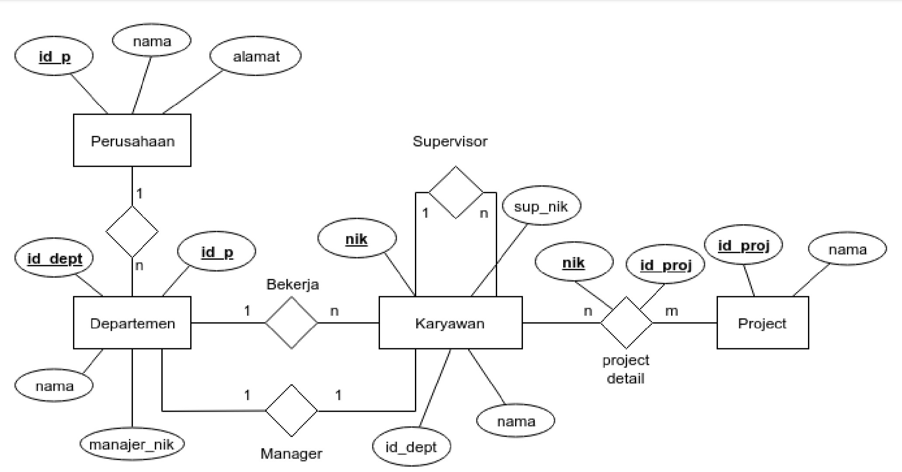
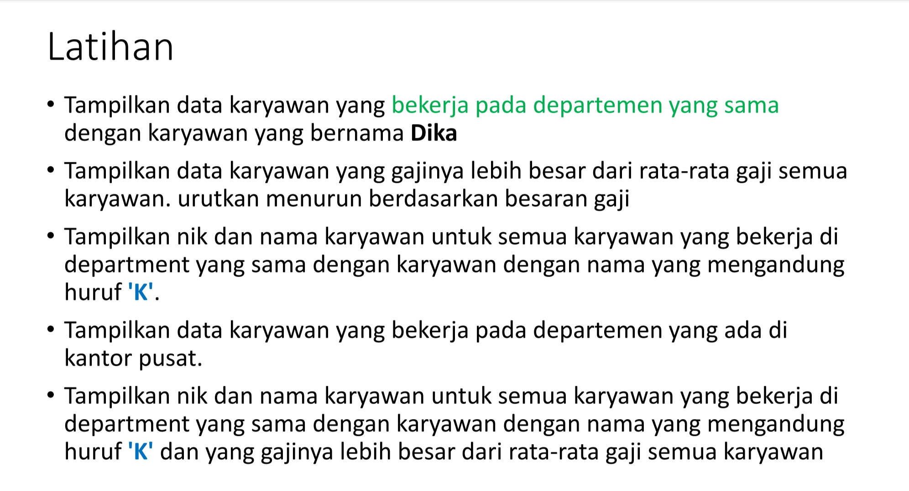

# PRAKTIKUM 7 - SUB QUERY

- Sub Query adalah suatu query yang menjadi bagian dari suatu query. Sub Query digunakan untuk menangani masalah yang kompleks yang mungkin sulit untuk dilakukan hanya dengan sebuah query.

- Menyediakan cara alternatif untuk melakukan operasi yang membutuhkan join atau union yang rumit. Sub- query dapat ditempatkan dalam klausa SQL berikut:

    - FROM
    - WHERE
    - HAVING

# SKEMA INPUT DATA - STUDI KASUS

### Script Table Perusahaan

### Output Table Perusahaan

### Script Table Departemen

### Output Table Departemen

### Script Table Project

### Output Table Project

### Script Table Karyawan

### Output Table Karyawan

### Script Table Project Detail

### Output Table Project Detail

# LATIHAN - PRAKTIKUM 7 

1. Tampilkan data karyawan yang bekerja pada departemen yang sama dengan karyawan yang bernama Dika

2. Tampilkan data karyawan yang gajinya lebih besar dari rata-rata gaji semua karyawan. Urutkan menurun berdasarkan besaran gaji

3. Tampilkan nik dan nama karyawan untuk semua karyawan yang bekerja di departmen yang sama dengan karyawan dengan nama yang mengandung huruf 'K'.

4. Tampilkan data karyawan yang bekerja pada departemen yang ada di Kantor pusat.

5. Tampilkan nik dan nama karyawan untuk semua karyawan yang bekerja di departmen yang sama dengan karyawan dengan nama yang mengandung huruf 'K' dan yang gajinya lebih besar dari rata-rata gaji semua karyawan

